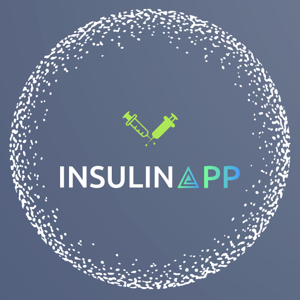

# Insulin App 

[DE]

Die Insulin App ist in Ersterlinie für Diabetiker Typ1 Kinder gedacht.

Die App soll beim berechnen der zu spritzenden Insulineinheiten helfen. Das bunte Design muntert etwas auf wodurch sie die Krankheit nicht mehr so sehr als Last sehen.

### Bedienung

- Zu erst speichert man den Insulin- und Korrekturfaktor ab
- Im nächsten Schritt gibt man auf der 'Start' Seite, den aktuell gemessenen Blutzuckerert und die Kohlenhydrate die man zu sich nehmen möchte ein
- Tippt / klickt auf bestätigen und bekommt sofort angezeigt wieviel Insulin man spritzen muss

Auf der Seite 'Daten' werden die benutzten Eingaben der 'Start' Seite mit Datum gespeichert, so das man sie jederzeit abrufen kann um eine gute Übersicht zu haben.

Die eingegeben Faktoren werden gespeichert und müssen so nicht jedesmal neu eingegeben werden.

[EN]

The insulin app is primarily intended for type 1 diabetic children.

The app is intended to help them calculate the insulin units they need to inject. The colourful design cheers you up a little, so you don't see the disease as such a burden.

### Operation

- First you save the insulin and correction factor
- In the next step, on the 'Start' page, enter the currently measured blood glucose value and the carbohydrates you would like to consume.
- Tap / click on confirm and you will immediately see how much insulin you need to inject.

On the 'Data' page, the entries used on the 'Start' page are saved with the date, so that you can call them up at any time to have a good overview.

The factors entered are saved and do not have to be entered each time.

## Update

August.21.2023

[DE]

Mit diesen update ist es jetzt möglich seine gespeicherten Daten als PDF zu exportieren.
Zu dem gibt es jetzt die Möglichkeit, durch einen klick auf , seine gesammten Daten zu löschen .

 

[EN]
 

With this update it is now possible to export your saved data as a PDF.
In addition, it is now possible to delete all data by clicking on .

Juni.26.2023

[DE]

Mit dem update wird die Eingabe der Daten erleichter, da die Faktoren nicht mehr gewählt werden müssen. Diese werden nun anhand der aktuellen Tageszeit automatisch gewählt und gesetzt.

[EN]

The update makes it easier to enter the data, as the factors no longer have to be selected. They are now automatically selected and set based on the current time of day.

## Tech Stack

| JavaScript | React.js | Next.js | Next-Auth | MongoDB | Mongoose |

## Project Setup

- Clone this repository
- Open it in VSCode
- Inside root folder install all dependencies via `npm install`
- Create a file called `.env.local.`
- Store an environment variable called `MONGODB_URL` with the connection string provided by MongoDB.
  Usually something like this: `MONGODB_URL='mongodb://127.0.0.1:27017/<name-of-db>'`
- Make sure to add the name of your database to the url!
- Run app in development mode via `npm run dev`

This is a [Next.js](https://nextjs.org/) project bootstrapped with [`create-next-app`](https://github.com/vercel/next.js/tree/canary/packages/create-next-app).

## Capstone Project

This is my Capstone Project from my Bootcamp by [neuefische](https://www.neuefische.de/)
